# Simple Medicine Logger Fullstack Architecture Document

## Introduction

This document outlines the complete fullstack architecture for Simple Medicine Logger, including backend systems, frontend implementation, and their integration. It serves as the single source of truth for AI-driven development, ensuring consistency across the entire technology stack.

This unified approach combines what would traditionally be separate backend and frontend architecture documents, streamlining the development process for modern fullstack applications where these concerns are increasingly intertwined.

### Starter Template or Existing Project

After reviewing the PRD and project structure, this is **not a greenfield project**. The Simple Medicine Logger already has an established MVP architecture that Epic 1 builds upon.

**Existing Project Analysis:**

**Current Architecture Foundation:**
- **Monorepo Structure:** Already established with `/client` (React) and `/server` (Node.js/Express)
- **Database:** SQLite with existing schemas for medications, users, and medication logs
- **API Layer:** Express REST API with medications and users endpoints
- **Frontend:** React with routing, service layer, and component architecture
- **Offline-First:** Already implemented with local storage and sync capabilities

**Epic 1 Integration Constraints:**
- Must maintain backward compatibility with existing MVP functionality
- Cannot modify core database schema significantly
- Must preserve existing API contracts
- Photo recognition features are additive, not replacement

**Pre-configured Choices to Retain:**
- Node.js/Express backend architecture
- React frontend with existing component patterns
- SQLite database with current schema
- REST API approach
- Offline-first data handling

**Architectural Decisions Already Made:**
- Monorepo with clear client/server separation
- Express middleware patterns for API routes
- React Router for frontend navigation
- Service layer pattern for API communication
- Component-based UI architecture

**Extensions Required for Epic 1:**
- Client-side OCR processing capabilities
- Camera/file upload integration
- Image processing utilities
- Enhanced AddMedication workflow
- Photo capture component architecture

### Change Log
| Date | Version | Description | Author |
|------|---------|-------------|---------|
| 2025-09-05 | 1.0 | Epic 1 Architecture - Photo Recognition Extension | Winston |

## High Level Architecture

### Technical Summary

The Simple Medicine Logger employs a **client-server monorepo architecture** with offline-first capabilities, extended for Epic 1 with **client-side photo recognition processing**. The React frontend handles all user interactions including camera capture and OCR processing using Tesseract.js, while the Node.js/Express backend maintains medication data persistence through SQLite. **Key integration points** include the enhanced AddMedication workflow that seamlessly blends manual entry with photo-extracted data, and the service layer that abstracts API communication for offline synchronization. The architecture deploys as **separate client/server applications** with the frontend handling static asset serving and the backend providing REST APIs. This approach achieves PRD goals by **reducing manual entry friction through intelligent photo recognition** while maintaining the proven offline-first architecture and privacy-by-design principles.

### Platform and Infrastructure Choice

**Platform:** Development/Simple Cloud (Vercel + Railway)
**Key Services:** Vercel (React frontend), Railway (Node.js backend), SQLite (database), local browser storage
**Deployment Host and Regions:** Vercel global CDN, Railway US/EU regions

### Repository Structure

**Structure:** Monorepo (current)
**Monorepo Tool:** npm workspaces (existing)
**Package Organization:** Client/Server separation with shared utilities in client-side utils

### High Level Architecture Diagram

```mermaid
graph TB
    User[👤 User] --> WebApp[📱 React Web App]
    WebApp --> Camera[📷 Camera Capture]
    WebApp --> OCR[🔍 OCR Processing<br/>Tesseract.js]
    WebApp --> API[🔌 REST API<br/>Express.js]
    
    Camera --> PhotoWorkflow[📋 Photo Workflow<br/>Components]
    PhotoWorkflow --> ImageProcess[🖼️ Image Processing<br/>Canvas API]
    ImageProcess --> OCR
    OCR --> DataVerify[✅ Data Verification<br/>Component]
    DataVerify --> API
    
    API --> SQLite[(🗄️ SQLite Database)]
    SQLite --> MedTable[(💊 Medications)]
    SQLite --> LogTable[(📊 Medication Logs)]
    
    WebApp --> PWA[📲 PWA Features<br/>Offline Storage]
    WebApp --> Sync[🔄 Offline Sync<br/>Service]
    
    subgraph "Epic 1 Extensions"
        Camera
        PhotoWorkflow
        ImageProcess
        OCR
        DataVerify
    end
    
    subgraph "Existing MVP"
        API
        SQLite
        MedTable
        LogTable
        PWA
        Sync
    end
```



### Architectural Patterns

- **Component-Based Architecture:** React components with clear separation of concerns - _Rationale:_ Enables reusable photo capture workflow components that integrate seamlessly with existing UI patterns
- **Client-Side Processing Pattern:** All photo/OCR processing happens in browser - _Rationale:_ Maintains offline-first architecture, ensures user privacy, and reduces server load
- **Progressive Enhancement Pattern:** Photo features enhance but don't replace manual entry - _Rationale:_ Maintains accessibility and provides fallback for unsupported devices or failed recognition
- **Workflow State Management:** Multi-step photo capture process with clear state transitions - _Rationale:_ Provides user control and transparency in the photo-to-data transformation process
- **Repository Pattern:** Existing service layer abstraction for API calls - _Rationale:_ Maintains consistent data access patterns whether data comes from manual entry or photo extraction
- **Offline-First Pattern:** All features work without internet connectivity - _Rationale:_ Core requirement from PRD and existing architecture principle

## Tech Stack

| Category | Technology | Version | Purpose | Rationale |
|----------|-----------|---------|---------|-----------|
| Frontend Language | JavaScript | ES2022 | Core frontend development | Existing codebase standard, mature ecosystem |
| Frontend Framework | React | ^18.2.0 | UI component framework | Already implemented, proven for offline-first apps |
| UI Component Library | Native HTML/CSS | - | Basic UI components | Maintains lightweight approach, existing custom styles |
| State Management | React Hooks | Built-in | Local component state management | Sufficient for current scope, avoids complexity |
| Backend Language | JavaScript (Node.js) | ^18.x | Server-side development | Existing implementation, consistent language stack |
| Backend Framework | Express.js | ^4.18.0 | Web application framework | Already implemented, lightweight, proven |
| API Style | REST | - | Client-server communication | Existing implementation, simple and reliable |
| Database | SQLite | ^3.x | Local data persistence | Existing implementation, perfect for offline-first |
| Cache | Browser Storage | Native | Client-side caching | LocalStorage/IndexedDB for offline capability |
| File Storage | Local Browser | Native | Temporary photo storage | Photos processed locally and deleted for privacy |
| Authentication | None (MVP) | - | User identification | Current MVP approach, future enhancement |
| Frontend Testing | Manual | - | Component and workflow testing | Current approach, manual verification of photo workflows |
| Backend Testing | Manual | - | API endpoint testing | Current approach, manual API verification |
| E2E Testing | Manual | - | Full user journey testing | Current approach, manual photo capture testing |
| Build Tool | npm scripts | Built-in | Build automation | Existing implementation, simple and effective |
| Bundler | Create React App | ^5.0.1 | Frontend bundling | Existing implementation, handles all bundling needs |
| IaC Tool | None | - | Infrastructure management | Simple deployment, no complex infrastructure |
| CI/CD | Manual | - | Deployment process | Current approach, suitable for Epic 1 scope |
| Monitoring | Browser DevTools | Native | Development monitoring | Sufficient for development phase |
| Logging | console.log | Native | Basic logging | Current approach, adequate for Epic 1 |
| CSS Framework | Custom CSS | - | Styling and layout | Existing custom styles, maintains design consistency |
| **Epic 1 Specific** | | | | |
| OCR Library | Tesseract.js | ^6.0.1 | Optical character recognition | Client-side processing, offline capable, proven accuracy |
| Camera Access | React-Webcam | ^7.2.0 | Camera capture functionality | Reliable WebRTC wrapper, good React integration |
| Image Processing | Canvas API | Native | Image optimization for OCR | Browser native, no external dependencies |
| Photo Capture | File API | Native | File upload alternative | Browser native, fallback for camera issues |

## Data Models

### Medication

**Purpose:** Represents a medication that a user tracks, now enhanced with optional photo recognition metadata

**Key Attributes:**
- id: number - Unique identifier for the medication
- name: string - Medication name (potentially OCR-extracted)
- dosage: string - Dosage information (potentially OCR-extracted) 
- frequency: string - How often to take (potentially OCR-extracted)
- notes: string - Additional notes (potentially OCR-extracted)
- extractedVia: string | null - Source of data ('manual', 'photo_recognition', null for legacy)
- ocrConfidence: number | null - OCR confidence score (0-100) if photo-extracted
- createdAt: string - ISO timestamp of creation
- updatedAt: string - ISO timestamp of last update

#### TypeScript Interface
```typescript
interface Medication {
  id: number;
  name: string;
  dosage?: string;
  frequency?: string;
  notes?: string;
  extractedVia?: 'manual' | 'photo_recognition' | null;
  ocrConfidence?: number | null;
  createdAt: string;
  updatedAt: string;
}
```

#### Relationships
- Has many MedicationLog entries (one-to-many)
- Belongs to User (when authentication is implemented)

### MedicationLog

**Purpose:** Records individual instances of medication taking, unchanged from MVP

**Key Attributes:**
- id: number - Unique identifier for the log entry
- medicationId: number - Foreign key to Medication
- takenAt: string - ISO timestamp when medication was taken
- notes: string - Optional notes about this specific dose
- createdAt: string - ISO timestamp of log creation

#### TypeScript Interface
```typescript
interface MedicationLog {
  id: number;
  medicationId: number;
  takenAt: string;
  notes?: string;
  createdAt: string;
}
```

#### Relationships
- Belongs to Medication (many-to-one)
- Used for adherence calculations and progress visualization

### OCRResult (Internal Processing)

**Purpose:** Temporary data structure for OCR processing workflow, not persisted

#### TypeScript Interface
```typescript
interface OCRResult {
  success: boolean;
  confidence: number;
  rawText: string;
  parsedData: ParsedMedicationData;
  error?: string;
  processedAt: string;
}

interface ParsedMedicationData {
  medicationName?: string;
  dosage?: string;
  instructions?: string;
  generic?: string;
  suggestions?: string[];
  confidence: 'high' | 'medium' | 'low';
}
```

#### Relationships
- Temporary processing data, transforms into Medication entity
- Not stored in database, exists only during photo workflow

## API Specification

```yaml
openapi: 3.0.0
info:
  title: Simple Medicine Logger API
  version: 1.1.0
  description: REST API for medication tracking with photo recognition support (Epic 1)
servers:
  - url: http://localhost:3001/api
    description: Development server
paths:
  /medications:
    get:
      summary: Get all medications for user
      responses:
        '200':
          description: List of medications
          content:
            application/json:
              schema:
                type: object
                properties:
                  data:
                    type: array
                    items:
                      $ref: '#/components/schemas/Medication'
    post:
      summary: Create new medication
      requestBody:
        required: true
        content:
          application/json:
            schema:
              $ref: '#/components/schemas/MedicationCreate'
      responses:
        '201':
          description: Medication created
          content:
            application/json:
              schema:
                type: object
                properties:
                  data:
                    $ref: '#/components/schemas/Medication'
  /medications/{id}/logs:
    post:
      summary: Log medication dose
      parameters:
        - name: id
          in: path
          required: true
          schema:
            type: integer
      requestBody:
        required: true
        content:
          application/json:
            schema:
              $ref: '#/components/schemas/MedicationLogCreate'
      responses:
        '201':
          description: Dose logged
components:
  schemas:
    Medication:
      type: object
      properties:
        id:
          type: integer
        name:
          type: string
        dosage:
          type: string
        frequency:
          type: string
        notes:
          type: string
        extractedVia:
          type: string
          enum: [manual, photo_recognition]
          nullable: true
        ocrConfidence:
          type: number
          minimum: 0
          maximum: 100
          nullable: true
        createdAt:
          type: string
          format: date-time
        updatedAt:
          type: string
          format: date-time
    MedicationCreate:
      type: object
      required:
        - name
      properties:
        name:
          type: string
        dosage:
          type: string
        frequency:
          type: string
        notes:
          type: string
        extractedVia:
          type: string
          enum: [manual, photo_recognition]
        ocrConfidence:
          type: number
          minimum: 0
          maximum: 100
```

## Components

### PhotoCaptureWorkflow

**Responsibility:** Orchestrates the complete photo-to-medication workflow including camera access, image processing, OCR execution, and data verification

**Key Interfaces:**
- onMedicationExtracted(medicationData) - Callback when OCR completes successfully
- onCancel() - Callback when user cancels workflow
- Camera permission management and error handling

**Dependencies:** CameraCapture, ImagePreview, DataVerification, OCRService, ImageProcessor

**Technology Stack:** React components, React-Webcam for camera access, Tesseract.js for OCR processing

### CameraCapture

**Responsibility:** Handles camera access, photo capture, and fallback to file upload

**Key Interfaces:**
- onCapture(file, dataUrl) - Emits captured photo data
- onClose() - Handles component cleanup and camera release
- Permission request and error state management

**Dependencies:** React-Webcam, Browser File API

**Technology Stack:** React functional component with hooks, WebRTC camera access

### OCRService

**Responsibility:** Processes images with Tesseract.js and extracts structured medication data

**Key Interfaces:**
- processImage(file) - Main OCR processing method
- setProgressCallback(callback) - Progress updates during processing
- Medication text parsing and confidence scoring

**Dependencies:** Tesseract.js, ImageProcessor for image optimization

**Technology Stack:** JavaScript service class, Tesseract.js WebAssembly, regex-based text parsing

### DataVerification

**Responsibility:** Presents OCR results for user verification and editing before saving

**Key Interfaces:**
- Display extracted data with confidence indicators
- Form editing capabilities for user corrections
- onConfirm(medicationData) - Emits verified medication data

**Dependencies:** React form handling, OCRResult data structure

**Technology Stack:** React functional component with form state management

```mermaid
graph TB
    User[👤 User] --> AddMed[📱 AddMedication Page]
    
    AddMed --> Manual[✏️ Manual Entry Form]
    AddMed --> PhotoWF[📸 PhotoCaptureWorkflow]
    
    PhotoWF --> CamCap[📷 CameraCapture]
    PhotoWF --> ImgPrev[🖼️ ImagePreview]
    PhotoWF --> DataVer[✅ DataVerification]
    
    CamCap --> ImgProc[🔧 ImageProcessor]
    ImgPrev --> ImgProc
    ImgProc --> OCRServ[🔍 OCRService]
    OCRServ --> DataVer
    
    Manual --> MedAPI[🔌 MedicationsAPI]
    DataVer --> MedAPI
    MedAPI --> ExpressAPI[⚡ Express REST API]
    ExpressAPI --> SQLite[(🗄️ SQLite Database)]
    
    subgraph "Epic 1 Photo Recognition"
        PhotoWF
        CamCap
        ImgPrev
        ImgProc
        OCRServ
        DataVer
    end
    
    subgraph "Existing MVP Core"
        AddMed
        Manual
        MedAPI
        ExpressAPI
        SQLite
    end
    
    style PhotoWF fill:#e1f5fe
    style CamCap fill:#e1f5fe
    style ImgPrev fill:#e1f5fe
    style ImgProc fill:#e1f5fe
    style OCRServ fill:#e1f5fe
    style DataVer fill:#e1f5fe
```



## External APIs

No external APIs are required for Epic 1 implementation. The architecture maintains the offline-first principle by processing everything locally.

**Client-Side Processing Only:**
- **Camera Access:** Browser WebRTC APIs (getUserMedia)
- **File Processing:** Browser File API and Canvas API
- **OCR Processing:** Tesseract.js (client-side WebAssembly)
- **Image Processing:** Native Canvas API operations

## Core Workflows


## Database Schema

```sql
-- Enhanced medications table with Epic 1 fields
CREATE TABLE IF NOT EXISTS medications (
    id INTEGER PRIMARY KEY AUTOINCREMENT,
    user_id INTEGER DEFAULT 1,
    name TEXT NOT NULL,
    dosage TEXT,
    frequency TEXT,
    notes TEXT,
    -- Epic 1 additions (optional fields for backward compatibility)
    extracted_via TEXT CHECK(extracted_via IN ('manual', 'photo_recognition')),
    ocr_confidence REAL CHECK(ocr_confidence >= 0 AND ocr_confidence <= 100),
    created_at DATETIME DEFAULT CURRENT_TIMESTAMP,
    updated_at DATETIME DEFAULT CURRENT_TIMESTAMP
);

-- Existing medication_logs table (no changes required)
CREATE TABLE IF NOT EXISTS medication_logs (
    id INTEGER PRIMARY KEY AUTOINCREMENT,
    medication_id INTEGER NOT NULL,
    taken_at DATETIME NOT NULL,
    notes TEXT,
    created_at DATETIME DEFAULT CURRENT_TIMESTAMP,
    FOREIGN KEY (medication_id) REFERENCES medications (id)
);

-- Indexes for performance
CREATE INDEX IF NOT EXISTS idx_medications_user_id ON medications(user_id);
CREATE INDEX IF NOT EXISTS idx_medication_logs_medication_id ON medication_logs(medication_id);
CREATE INDEX IF NOT EXISTS idx_medication_logs_taken_at ON medication_logs(taken_at);
```

## Frontend Architecture

### Component Architecture

#### Component Organization
```
src/
├── components/
│   ├── PhotoCapture/
│   │   ├── PhotoCaptureWorkflow.js    # Main workflow orchestrator
│   │   ├── CameraCapture.js           # Camera access and photo capture
│   │   ├── ImagePreview.js            # Image preview and processing controls
│   │   └── DataVerification.js        # OCR result verification and editing
│   ├── Charts/                        # Existing progress visualization
│   └── Navigation.js                  # Existing navigation component
├── pages/
│   ├── AddMedication.js              # Enhanced with photo workflow
│   ├── MedicationList.js             # Existing functionality
│   └── Progress.js                   # Existing analytics page
├── services/
│   ├── api.js                        # Existing API service layer
│   └── analyticsService.js           # Existing analytics
├── utils/
│   ├── ocrConfig.js                  # Tesseract.js OCR service
│   └── imageProcessing.js            # Canvas API image processing
└── App.js                            # Main application routing
```

### State Management Architecture

#### State Structure
```typescript
// Component-level state management using React hooks
interface PhotoWorkflowState {
  currentStep: 'camera' | 'preview' | 'processing' | 'verification';
  capturedImage: File | null;
  imageSrc: string | null;
  ocrResult: OCRResult | null;
  isProcessing: boolean;
  processingProgress: number;
  error: string | null;
}
```

#### State Management Patterns
- **Local Component State:** React useState for component-specific data like photo workflow progress
- **API State Management:** Service layer pattern with loading/error states for API interactions  
- **Form State:** Controlled components with React hooks for form data management
- **Temporary State:** OCR processing state that doesn't persist beyond workflow completion

### Frontend Services Layer

#### API Client Setup
```typescript
import axios from 'axios';

const apiClient = axios.create({
  baseURL: '/api',
  timeout: 10000,
});

export default apiClient;
```

#### Service Example
```typescript
export const medicationsAPI = {
  async create(medicationData: MedicationCreate): Promise<{ data: Medication }> {
    const response = await apiClient.post('/medications', medicationData);
    return response.data;
  },
  
  async getAll(): Promise<{ data: Medication[] }> {
    const response = await apiClient.get('/medications');
    return response.data;
  }
};
```

## Backend Architecture

### Service Architecture

#### Controller/Route Organization
```
server/
├── routes/
│   ├── medications.js    # Enhanced with Epic 1 metadata support
│   └── users.js         # Existing user management
├── db/
│   └── database.js      # SQLite database connection
└── index.js             # Express server setup
```

### Database Architecture

#### Data Access Layer
```typescript
const sqlite3 = require('sqlite3').verbose();
const path = require('path');

class Database {
  constructor() {
    this.db = new sqlite3.Database(path.join(__dirname, 'simple_todo.db'));
  }

  async run(query, params = []) {
    return new Promise((resolve, reject) => {
      this.db.run(query, params, function(err) {
        if (err) reject(err);
        else resolve({ lastID: this.lastID, changes: this.changes });
      });
    });
  }
}

module.exports = new Database();
```

## Unified Project Structure

```plaintext
simple-medicine-logger/
├── client/                     # React frontend application
│   ├── public/
│   │   ├── index.html
│   │   └── manifest.json       # PWA manifest
│   ├── src/
│   │   ├── components/         # Reusable UI components
│   │   │   ├── PhotoCapture/   # Epic 1 photo workflow components
│   │   │   │   ├── PhotoCaptureWorkflow.js
│   │   │   │   ├── CameraCapture.js
│   │   │   │   ├── ImagePreview.js
│   │   │   │   └── DataVerification.js
│   │   │   ├── Charts/         # Progress visualization components
│   │   │   └── Navigation.js   # App navigation
│   │   ├── pages/              # Page-level components
│   │   │   ├── AddMedication.js # Enhanced with photo workflow
│   │   │   ├── MedicationList.js
│   │   │   └── Progress.js
│   │   ├── services/           # API communication layer
│   │   │   └── api.js          # Medications API service
│   │   ├── utils/              # Utility functions
│   │   │   ├── ocrConfig.js    # Tesseract.js OCR service
│   │   │   └── imageProcessing.js # Canvas API image utils
│   │   ├── App.js              # Main app component with routing
│   │   └── index.js            # React app entry point
│   └── package.json            # Frontend dependencies
├── server/                     # Node.js backend application
│   ├── db/
│   │   ├── database.js         # SQLite database connection
│   │   └── simple_todo.db      # SQLite database file
│   ├── routes/
│   │   ├── medications.js      # Enhanced medications API
│   │   └── users.js           # User management API
│   ├── index.js               # Express server setup
│   └── package.json           # Backend dependencies
├── docs/                      # Documentation
│   ├── prd.md                # Product Requirements Document
│   └── architecture.md       # This document
├── package.json              # Root monorepo configuration
└── README.md                # Project documentation
```

## Development Workflow

### Local Development Setup

#### Prerequisites
```bash
# Required software
node --version  # v18.x or higher
npm --version   # v8.x or higher
git --version   # Any recent version
```

#### Initial Setup
```bash
# Clone repository
git clone <repository-url>
cd simple-medicine-logger

# Install root dependencies
npm install

# Install client dependencies
cd client && npm install && cd ..

# Install server dependencies  
cd server && npm install && cd ..
```

#### Development Commands
```bash
# Start all services (client + server)
npm run dev

# Start frontend only (port 3000)
cd client && npm start

# Start backend only (port 3001)
cd server && npm run dev
```

## Deployment Architecture

### Deployment Strategy

**Frontend Deployment:**
- **Platform:** Vercel (recommended for React apps)
- **Build Command:** `cd client && npm run build`
- **Output Directory:** `client/build`
- **CDN/Edge:** Vercel global CDN with automatic optimization

**Backend Deployment:**
- **Platform:** Railway (simple Node.js hosting)
- **Build Command:** `cd server && npm install`
- **Deployment Method:** Git-based automatic deployments

### Environments
| Environment | Frontend URL | Backend URL | Purpose |
|-------------|-------------|-------------|---------|
| Development | http://localhost:3000 | http://localhost:3001 | Local development |
| Staging | https://staging-simple-med.vercel.app | https://staging-api.railway.app | Pre-production testing |
| Production | https://simple-medicine-logger.vercel.app | https://api.railway.app | Live environment |

## Security and Performance

### Security Requirements

**Frontend Security:**
- CSP Headers: `default-src 'self'; img-src 'self' data: blob:; script-src 'self'`
- XSS Prevention: React's built-in XSS protection via JSX escaping
- Secure Storage: LocalStorage for offline data, no sensitive information

**Backend Security:**
- Input Validation: Express validator middleware for all API inputs
- Rate Limiting: Express rate limiter (100 requests per 15 minutes per IP)
- CORS Policy: Restricted to frontend domain only

### Performance Optimization

**Frontend Performance:**
- Bundle Size Target: < 2MB total bundle size
- Loading Strategy: Code splitting for photo capture components
- Caching Strategy: Service worker for offline capability, cache API responses

**Backend Performance:**
- Response Time Target: < 500ms for API responses
- Database Optimization: Proper indexing on frequently queried columns
- Caching Strategy: In-memory caching for frequently accessed data

## Testing Strategy

### Testing Pyramid
```
E2E Tests
/        \
Integration Tests  
/            \
Frontend Unit  Backend Unit
```

### Test Organization

#### Frontend Tests
```
client/src/components/PhotoCapture/__tests__/
├── PhotoCaptureWorkflow.test.js
├── CameraCapture.test.js
└── DataVerification.test.js
```

#### Backend Tests
```
server/routes/__tests__/
└── medications.test.js
```

## Coding Standards

### Critical Fullstack Rules

- **Type Safety:** Use TypeScript interfaces for all data models shared between frontend and backend
- **API Consistency:** All API responses must follow the `{ data: T }` or `{ error: string }` format
- **Error Handling:** Frontend components must handle loading, success, and error states for all async operations
- **Privacy Protection:** Never store image data - process and delete immediately after OCR extraction
- **Offline Support:** All Epic 1 features must work without internet connectivity after initial load

### Naming Conventions
| Element | Frontend | Backend | Example |
|---------|----------|---------|---------|
| Components | PascalCase | - | `PhotoCaptureWorkflow.js` |
| Hooks | camelCase with 'use' | - | `useOCRProcessing.js` |
| API Routes | - | kebab-case | `/api/medications` |
| Database Tables | - | snake_case | `medication_logs` |

## Error Handling Strategy

### Error Response Format
```typescript
interface ApiError {
  error: {
    code: string;
    message: string;
    details?: Record<string, any>;
    timestamp: string;
    requestId: string;
  };
}
```

### Frontend Error Handling
```typescript
const useAsyncOperation = () => {
  const [loading, setLoading] = useState(false);
  const [error, setError] = useState<string | null>(null);

  const execute = async (operation: () => Promise<any>) => {
    try {
      setLoading(true);
      setError(null);
      const result = await operation();
      return result;
    } catch (err) {
      const errorMessage = err instanceof Error ? err.message : 'An unexpected error occurred';
      setError(errorMessage);
      console.error('Operation failed:', err);
      throw err;
    } finally {
      setLoading(false);
    }
  };

  return { execute, loading, error };
};
```

## Monitoring and Observability

### Monitoring Stack
- **Frontend Monitoring:** Browser console and network tab for development
- **Backend Monitoring:** Console logging with structured output
- **Error Tracking:** Console error logging (future: Sentry integration)
- **Performance Monitoring:** Browser DevTools Performance tab

### Key Metrics

**Frontend Metrics:**
- Core Web Vitals (LCP, FID, CLS)
- JavaScript errors and exceptions
- API response times from client perspective
- Photo capture success/failure rates
- OCR processing time and accuracy

**Backend Metrics:**
- Request rate per endpoint
- Error rate by endpoint and error type
- Response time percentiles (p50, p95, p99)
- Database query performance
- Photo processing workflow completion rates

## Checklist Results Report

The complete fullstack architecture document has been created for Epic 1 (Photo Recognition for Medication Entry). This architecture extends the existing Simple Medicine Logger MVP with client-side photo processing capabilities while maintaining offline-first principles and privacy protection.

**Key Architectural Achievements:**

✅ **Unified Architecture:** Single document covering both frontend and backend concerns for Epic 1
✅ **Privacy by Design:** All photo processing happens client-side with immediate deletion after data extraction
✅ **Offline-First Maintained:** All new features work without internet connectivity
✅ **Backward Compatibility:** Existing MVP functionality remains unchanged
✅ **Technology Stack Defined:** Complete tech stack selection with rationale for each choice
✅ **Component Architecture:** Detailed component design for photo capture workflow
✅ **API Specification:** Extended REST API supporting OCR metadata
✅ **Database Schema:** Enhanced schema maintaining compatibility with existing data
✅ **Development Workflow:** Complete setup and deployment procedures
✅ **Testing Strategy:** Comprehensive testing approach across all layers

This architecture document serves as the definitive guide for implementing Epic 1's photo recognition functionality, ensuring all development work aligns with established patterns while adding the intelligent features required by the PRD.